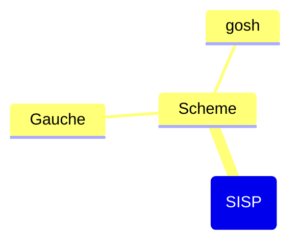

# SISP関連の用語とか

```mermaid
mindmap
root(SISP)
    Scheme
        Gauche
        gosh
```

- Scheme = 言語仕様(規格)。R5RS / R7RS といった標準がある
- Gauche = その仕様を実装した処理系のひとつ(Shiro Kawai 氏作、日本発)
- gosh = Gauche の対話シェル / スクリプト実行コマンドの名前(Gouche shell)
